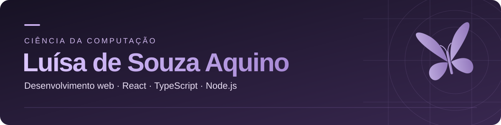

  

  
  
  

### Oi, eu sou a Luísa

Estudo **Ciência da Computação na Cruzeiro do Sul**, com conclusão prevista para **dezembro de 2028**. Gosto de desenvolver aplicações web e transformar necessidades do dia a dia em projetos.

Estou construindo meu portfólio com **React, TypeScript, Node.js e Express** e buscando minha primeira oportunidade de estágio em desenvolvimento. Também estudo inglês e trabalho com atendimento, onde aprendo a ouvir as pessoas e entender suas necessidades.

### Tecnologias que uso nos projetos

  

### Meu portfólio

| Projeto | O que desenvolvi | Tecnologias |
| :--- | :--- | :--- |
| **[Central+](https://github.com/Luisasouza12/Compass-Project)** | Sistema de atendimento com protocolos, direcionamento por setor, painel administrativo e API REST. | JavaScript, Node.js, Express e SQLite |
| **[Rosa Digital](https://github.com/Luisasouza12/RosaDigital)** | Projeto de extensão para organizar pessoas, famílias, oficinas e participações de uma ONG. | Node.js, HTML, CSS e JavaScript |
| **[Site Rosa de Ouro](https://github.com/Luisasouza12/Site-Rosa-de-Ouro)** | Site da associação com apresentação das atividades, cadastro e painel de demonstração. | HTML, CSS e JavaScript |

**Em desenvolvimento — Vibee:** aplicação de descoberta de músicas com a API do iTunes, usando React, TypeScript, Vite e Express.

### Vamos conversar?

Você pode me encontrar no **[LinkedIn](https://www.linkedin.com/in/luisasouza0/)** para conversar sobre projetos e oportunidades de estágio.
